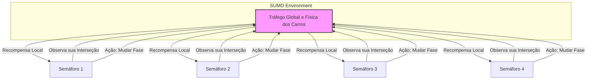
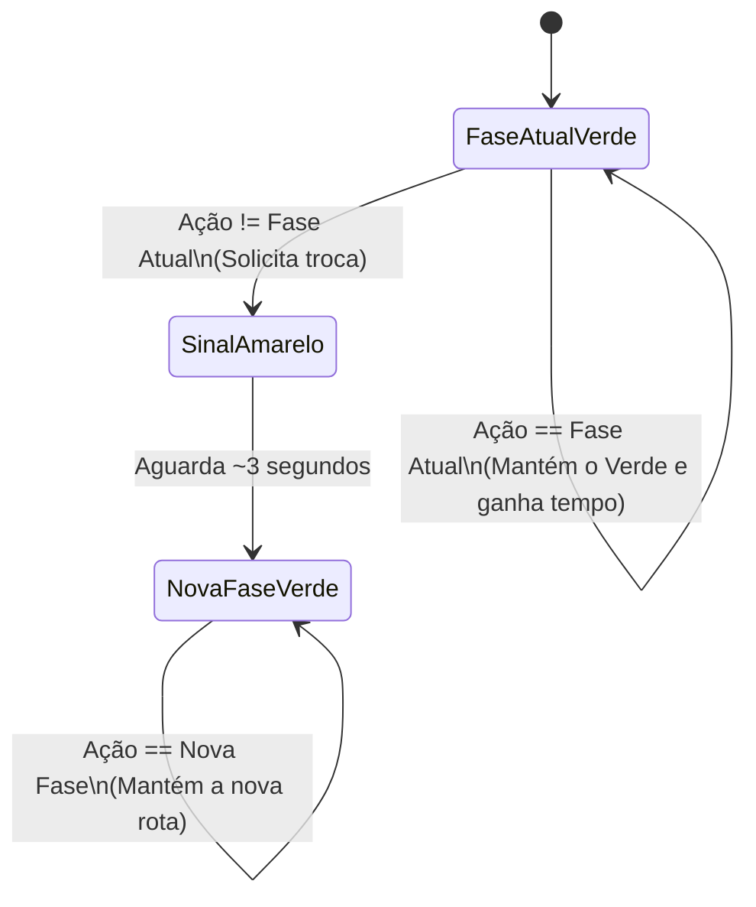

# Ambiente de Tráfego: sumo-rl

Este documento destrincha a natureza da simulação, os agentes envolvidos e o que esperamos que a IA aprenda.

## 🗺️ O Mapa Base: 2x2 Grid
O projeto roda em um mapa de malha 2x2 padrão (`nets/2x2grid`).
Isso significa que existem **4 cruzamentos principais**. Ruas chegam do Norte, Sul, Leste e Oeste conectando essas interseções. O SUMO gera rotas dinâmicas de carros (demandas) tentando fluir pela cidade.

## 🤖 Os Agentes
Nesse paradigma MARL (Multi-Agent Reinforcement Learning), **cada semáforo é um agente independente**.
Portanto, temos 4 Agentes neste cenário. Eles não "conversam" por rádio, eles apenas tomam ações de forma isolada com base no tráfego imediato que conseguem enxergar.

### Espaço de Observação (O que a rede enxerga?)
Em cada interseção (agente), o observador coleta um vetor (array) numérico que contém dados locais daquele semáforo:
- A fase atual em que ele se encontra.
- Quantos carros estão parados em cada faixa que entra no cruzamento (Queue/Fila).
- Quantos carros estão fluindo nas faixas de saída (Density/Densidade).
*(Por padrão, todos os dados são normalizados entre 0 e 1).*

## Espaço de Ação (O que a rede decide?)
A rede neural não escolhe "Amarelo" ou "Vermelho". A IA escolhe **qual Fase Verde deve ser ativada agora**. 
O tamanho desse Espaço de Ação varia conforme a complexidade do mapa:
- **Mapas 2x2 e 3x3 (4 Ações):** Cruzamentos completos com 4 vias. A IA pode escolher entre 4 Fases Verdes diferentes (ex: `0`: Verde Norte-Sul reto, `1`: Verde Norte-Sul virando, `2`: Verde Leste-Oeste reto, `3`: Verde Leste-Oeste virando).
- **Mapa 4x4 (2 Ações):** Neste mapa específico (`4x4-Lucas`), os cruzamentos são mais simples e não possuem faixa dedicada para conversão. A IA escolhe apenas entre 2 Fases Verdes (`0`: Verde Eixo Norte-Sul, `1`: Verde Eixo Leste-Oeste).

**O que acontece quando a IA toma uma Ação?**
1. Se a IA escolher a **mesma Fase Verde** que já está ativa, o sinal continua verde normalmente.
2. Se a IA escolher uma **Fase Verde diferente** da atual, o ambiente SUMO intervém: ele joga o semáforo automaticamente para a fase de transição (Sinal **Amarelo** por 2 a 3 segundos, imutável pela IA), e só depois muda para a nova Fase Verde que a IA pediu.
**(Isso significa que o Vermelho também é espelhado: quando a IA escolhe Verde pro Norte, o Leste automaticamente fica Vermelho).*

## 🎯 Objetivo e Recompensa
Nossa métrica/recompensa local do `sumo-rl` está definida como `diff-waiting-time` (Diferença do Tempo de Espera).
- **Recompensa**: $\text{Espera Anterior} - \text{Espera Atual}$.
- **Objetivo**: Evitar que carros fiquem muito tempo ociosos nas suas vias, reduzindo congestionamento.
- **Desejável**: O modelo perfeito percebe "ondas verdes". O cruzamento 1 fica verde a tempo do grande fluxo que acabou de ser liberado no cruzamento 2 passar sem parar de novo, alcançando cooperatividade emergente, essencial para QMIX e VDN brilhar em comparação ao IQL puro.
