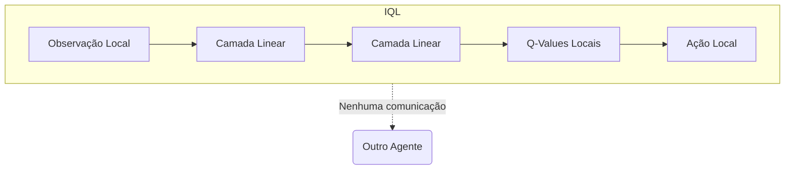
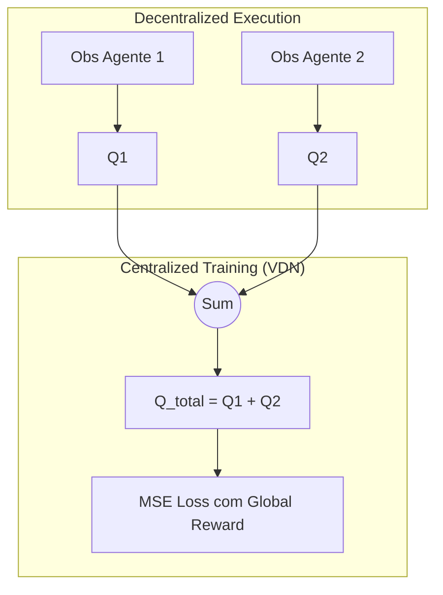
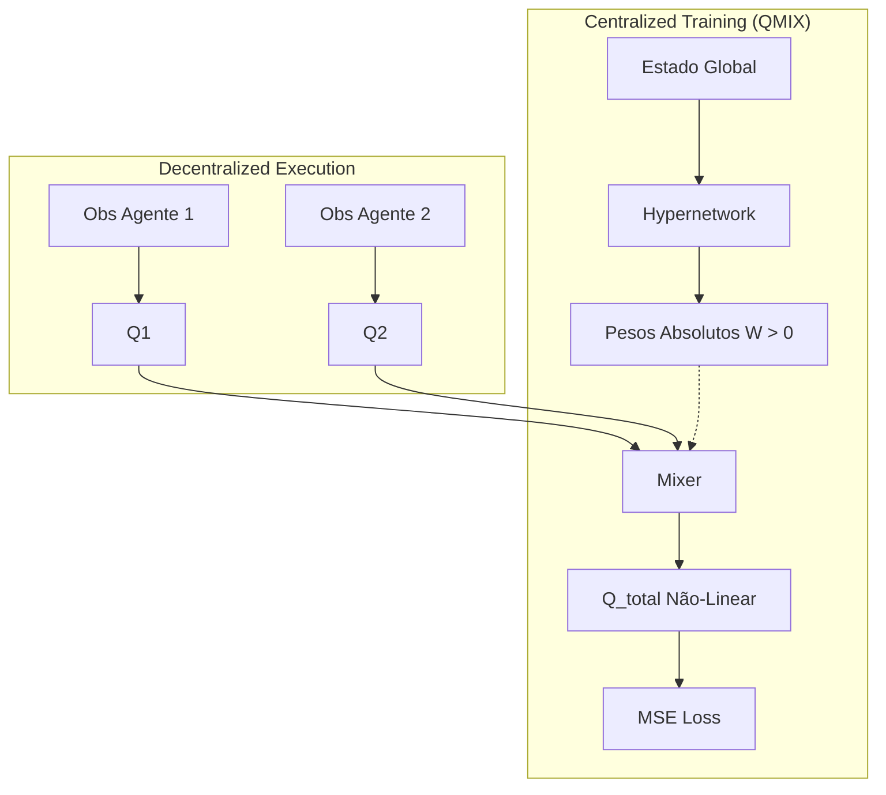

# Teoria: MARL em Controle de Tráfego

O controle de tráfego urbano é um problema naturalmente multi-agente, onde cada cruzamento é um agente controlando as fases de um semáforo. O objetivo global é minimizar o tempo de espera (ou tamanho das filas) em toda a rede.

## IQL (Independent Q-Learning)
No IQL, cada semáforo é tratado como um agente isolado. A falha principal do IQL é que o ambiente se torna não-estacionário, pois os outros semáforos também mudam suas políticas simultaneamente.

## VDN (Value Decomposition Networks)
VDN introduz o CTDE (Centralized Training, Decentralized Execution). Ele assume que a recompensa conjunta do sistema é a soma das recompensas individuais: $Q_{tot} = \sum_a Q_a$

## QMIX
QMIX expande o VDN ao permitir relações não-lineares, exigindo apenas que os pesos da combinação sejam não-negativos para garantir monotonicidade. O QMIX usa uma **Hypernetwork** que gera os pesos do mixer condicionada ao *estado global*.

## Estabilização do Treinamento (Tráfego)

Devido à natureza não-estacionária e à magnitude dos tempos de espera simulados (a penalidade pode crescer exponencialmente se um grande congestionamento ocorre), duas técnicas são fundamentais no treinamento prático do SUMO-RL:

### 1. Normalização de Recompensa
O SUMO-RL calcula o tempo de espera acumulado (ou tamanho da fila). Quando uma via inteira para, a recompensa em um único _step_ pode ser de -3000, e no próximo de -10. Variâncias gigantescas destroem os gradientes das Redes Neurais (explodindo o cálculo do erro). A **Normalização** (ex: dividir a recompensa bruta por 100) garante que o gradiente que atualiza a rede se mantenha em uma escala saudável, tipicamente entre -10 e 10.

### 2. Gradient Clipping
Mesmo com recompensas normalizadas, atualizações de políticas baseadas em cenários muito caóticos (exploração aleatória inicial do tráfego) podem causar saltos drásticos no espaço de pesos, fazendo o otimizador (Adam) falhar. O **Gradient Clipping** intervém cortando pela raiz a magnitude do vetor de gradiente se ele ultrapassar um limite (ex: `max_norm=1.0`). Isso mantém as atualizações de direção seguras, impedindo o modelo de "esquecer" subitamente uma boa política por causa de um _batch_ ruidoso de experiências.
